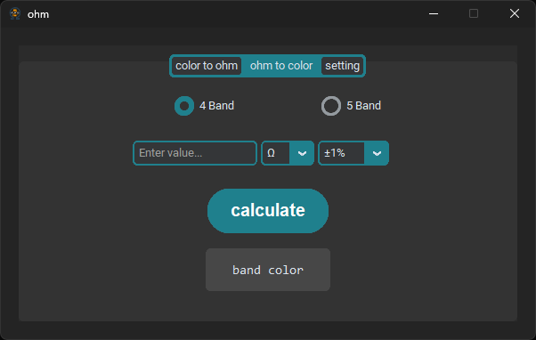
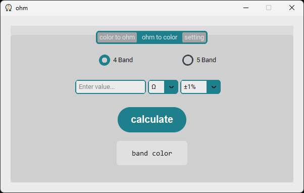
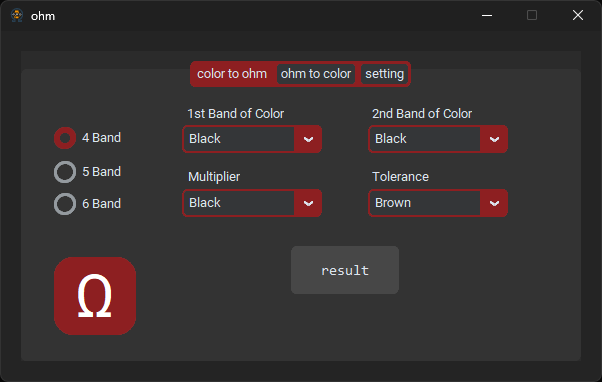
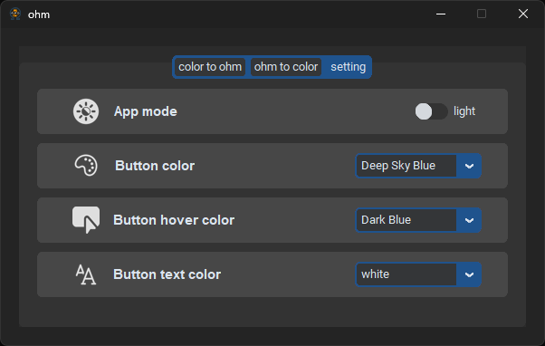

# 📄**Description:**
ohm is an easy-to-use application designed to simplify the process of converting resistor color codes to their corresponding values ​​and vice versa. This tool is essential for electronics enthusiasts, engineers and hobbyists who frequently work with resistors and need a quick reference alongside their AVO meter.

# 🧐**Overview:**

  
  
  
  

  

# 🌟**Features:**
- Simple graphical interface.
- Choose your own ohm.
- Know the true value of the resistor by the color of the resistor, if you are not sure about the resistance reading of the AVOmeter due to the error in the AVO.

# 📥**Installation:**
| Operating system | Version | Link                         |
|------------------|---------|------------------------------|
| Windows          |   1.0   | [**Download**](https://drive.google.com/file/d/1YtpfoyXwBClMJkL5PlNInB10Ys2siwKS/view?usp=sharing) |

---
### ⛔**Note:**
- The project is open source.
- I used ctk scrollable dropdown from: https://github.com/Akascape/CTkScrollableDropdown
